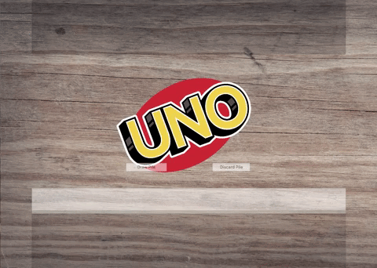
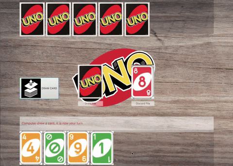
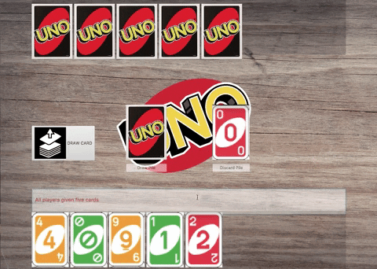
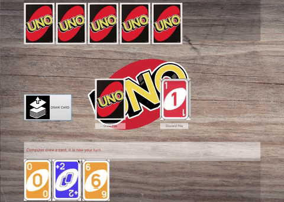
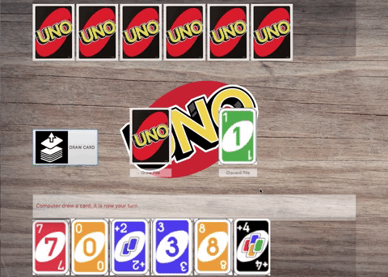

# UNO-in-JAVA
JAVA FX application made for UNO. Uses FXML templates in order to create the interface for UNO and multiple java classes to control different states.
  # Start Button
  
  Initializes all of the player decks, discard piles, draw piles, buttons, and controls. Then also establishes the design of all the initializations
  
  # Draw Card
  
  
  # Color Match
  
  
  # Plus Two
  
  
  # Wild Card
  
  
  # Plus Four
    
  
